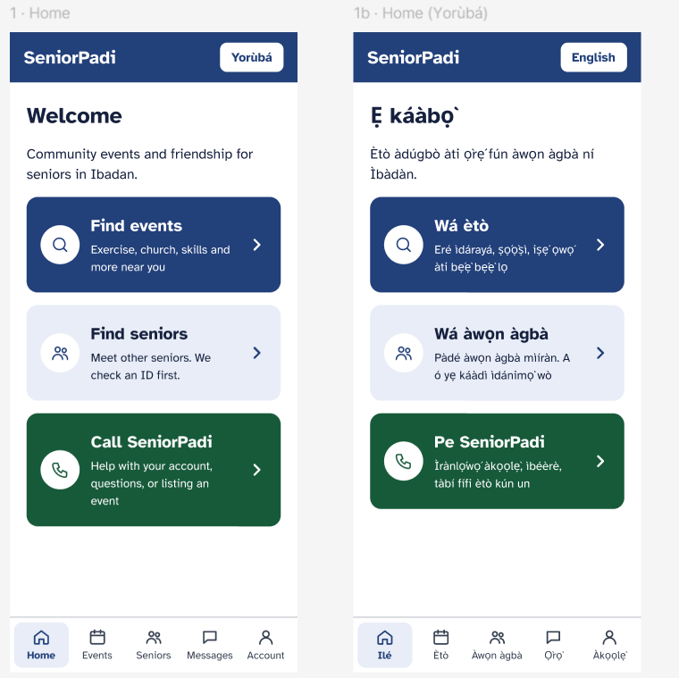
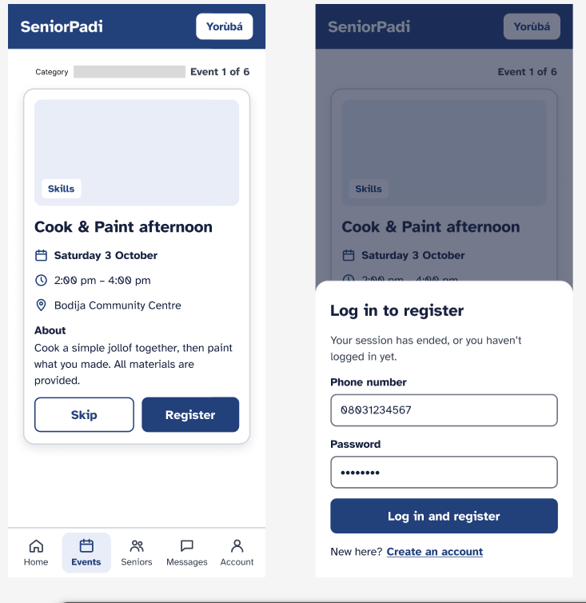
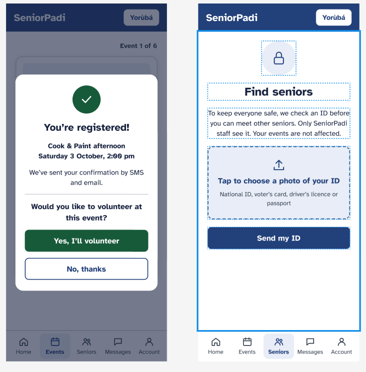
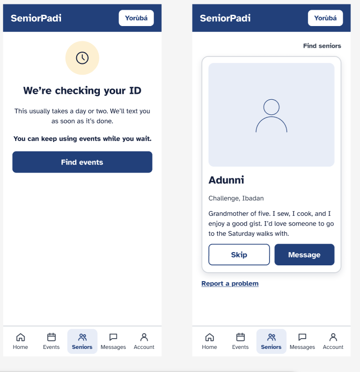
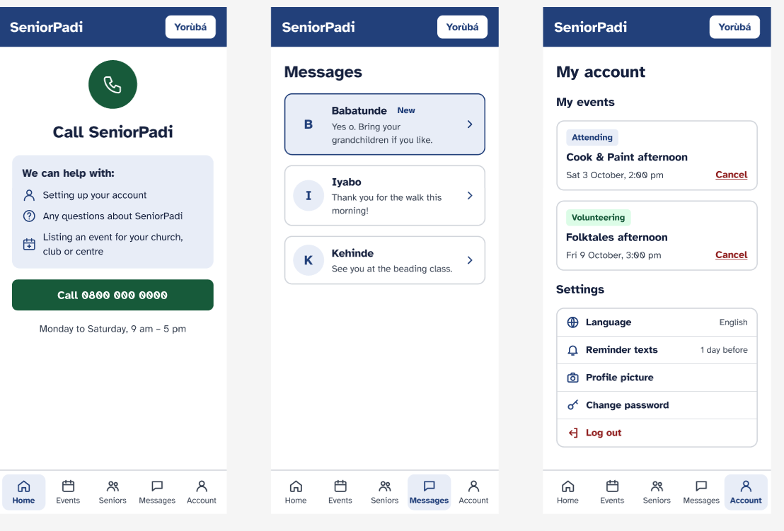

# SeniorPadi: Initial MVP (Full-Stack Track)

SeniorPadi is a free website that connects people aged 60 and over in Ibadan to community events (exercise, church, skills classes). Seniors can attend, volunteer, and meet other verified seniors safely. NGO staff run the events.

**GitHub:** https://github.com/Otani-ibe/SeniorPadi_Capstone.git · **Figma:** https://www.figma.com/design/sqFCpB8uT98d3noTAO0D8J/Untitled?node-id=16-2&t=rFjVQdjne0RzcCx4-1

---

## 1. Frontend Development

### 1.1 Design process
1. **Research:** older adults and technology (Chen, Koh & Wong, 2022; Omotayo, 2015, 2018). Most users have cheap phones and slow data, and family often helps.
2. **Mid-fidelity wireframes** in Figma to plan the flow.
3. **Review:** checked every screen against the research and simplified it.
4. **High-fidelity mockups** with final colours, font and components.
5. **Build** with EJS templates and Tailwind CSS, then test on phone and desktop.

### 1.2 Design considerations
- **Big and clear:** 18px text, buttons at least 48px tall, high contrast, every icon has a label.
- **Simple home page:** three choices only: Find events, Find seniors, Call SeniorPadi.
- **One language button:** it always shows the other language (Yorùbá / English), so switching is one tap.
- **One event at a time:** the details sit under the picture, with just Skip or Register.
- **No pressure:** no registration counts and no "only 2 left" messages.
- **Volunteering matters:** after registering, a pop-up asks if they'd like to volunteer.
- **Safety:** Find seniors stays locked until staff check an ID, and every profile has Report a problem.
- **Easy to move around:** the same five-item menu (Home, Events, Seniors, Messages, Account) on every page.
- **Works on weak phones:** pages are built on the server and work even with JavaScript off.

### 1.3 Figma designs


*Home in English and Yorùbá. The language button shows the other language.*


*Find events (one card at a time) and the log-in pop-up when the session has ended.*


*Registered pop-up with the volunteer choice, and Find seniors locked until the ID is checked.*


*ID being checked, and a verified profile with the bio under the photo.*


*Call SeniorPadi, Messages and My account.*


### 1.4 Frontend code

**Responsive design.** Buttons are full width on phones and shrink on bigger screens. Body text is 18px everywhere.

`src/styles/input.css`
```css
html {
  font-size: 112.5%; /* 18px body text */
}
.btn {
  @apply flex min-h-12 w-full items-center justify-center rounded-lg
    bg-indigo px-5 py-3 text-lg font-bold text-white sm:w-auto;
}
```

**Responsive menu.** The menu items wrap onto a new line on small screens instead of being cut off.

`views/partials/nav.ejs` 
```html
<nav aria-label="Main" class="mx-auto max-w-2xl px-2 pb-2">
  <ul class="flex flex-wrap gap-1">
    <% links.forEach(function (link) { %>
      <li><a href="<%= link.href %>"> <%= link.label %> </a></li>
    <% }) %>
  </ul>
</nav>
```

**DOM manipulation: phone number box.** Letters are removed as they are typed, and a red message appears.

`public/js/phone-input.js`
```js
input.addEventListener('input', function () {
  var cleaned = input.value.replace(/\D/g, '');
  if (cleaned !== input.value) {
    input.value = cleaned.slice(0, 11);
    show(input.getAttribute('data-msg-letters')); // "Numbers only, please"
  }
});
```

**DOM manipulation: live chat.** New messages are added to the page without reloading. `textContent` is used so nobody can inject HTML.

`public/js/chat.js`
```js
var body = document.createElement('p');
body.textContent = msg.body;
bubble.appendChild(body);
thread.appendChild(li);
```

---

## 2. Backend Development

### 2.1 Server-side code

**Stack:** Node.js and Express, PostgreSQL with Sequelize, EJS pages, Socket.IO for live chat, Cloudinary for files, Brevo for SMS and email.

**Main endpoints:**

| Endpoint | What it does |
|---|---|
| `GET /events`, `GET /events/:id` | List events, view one |
| `POST /events/:id/register` | Take a place (safe against overbooking) |
| `POST /events/:id/volunteer` | Volunteer at an event |
| `POST /signup`, `POST /login` | Accounts (phone + password, bcrypt) |
| `GET /find-seniors`, `POST /find-seniors/id` | Find seniors, upload ID |
| `GET/POST /messages/:seniorId` | Chat (live with Socket.IO) |
| `/admin/...` | Staff: events, attendance, ID checks, reports |

**Database interaction: no overbooking.** Registering locks the event row inside a transaction, so two people can't take the last seat.

`src/services/capacity.js`
```js
return sequelize.transaction(async (transaction) => {
  const event = await Event.findByPk(eventId, { transaction, lock: transaction.LOCK.UPDATE });
  const taken = await countTaken(eventId, type, transaction);
  if (taken >= capacityFor(event, type)) {
    return { ok: false, reason: 'full' };
  }
  const registration = await Registration.create({ eventId, seniorId, type }, { transaction });
  return { ok: true, registration, event };
});
```

**Server-side logic: private ID documents.** Staff get a link that expires in 5 minutes, and every view is logged.

`src/routes/admin.js` 
```js
router.get('/ids/:userId/view', async (req, res) => {
  const senior = await User.findOne({ where: { id: req.params.userId, role: 'senior' } });
  await audit(req.user.id, 'id.view', 'User', senior.id);
  res.redirect(cloud.signedIdUrl(senior.idDocumentPublicId, senior.idDocumentFormat));
});
```

### 2.2 Database schema

PostgreSQL. Tables are created by migrations that run automatically when the app starts.


| Table | Key fields | Links to |
|---|---|---|
| Users | fullName, phone (unique), passwordHash, role (senior/admin), verificationStatus, preferredLanguage | Registrations, Messages, Reports |
| Organizations | name, contact details | Events |
| Events | title, startsAt, endsAt, location, capacity, volunteerCapacity, registrationDeadline, status | Organizations, Registrations |
| Registrations | type (attendee/volunteer), status (registered/cancelled/attended/no_show), qrToken | Users, Events |
| Messages | senderId, recipientId, body | Users |
| Blocks, Reports, Skips | who blocked/reported/skipped whom | Users |
| Notifications | type, payload, readAt | Users |
| AuditLogs | who did what, when (staff actions) | Users |

- One senior can't register twice for the same event: unique `(eventId, seniorId, type)`.
- Accounts are never hard-deleted (`deletedAt`), so attendance history stays.
- Times are stored in UTC and shown in Lagos time.

### 2.3 Deployment

| Part | Platform |
|---|---|
| Website (Node.js app) | Render (deploys from GitHub) |
| Database | Neon (hosted PostgreSQL) |
| Pictures, IDs, video | Cloudinary |
| SMS and email | Brevo |

**How it's deployed:**
1. Code is pushed to GitHub.
2. In Render: New > Blueprint > pick the repo. `render.yaml` sets the build, the start command and the settings to fill in (database link, first admin, Brevo and Cloudinary keys).
3. On every start, the app connects to the database, runs any new migrations, and creates the first admin if there isn't one.
4. Every new push to GitHub redeploys automatically. `/health` is pinged every 5 minutes to keep the free plan awake.

**Local setup:** `npm install`, copy `.env.example` to `.env`, then `npm start`. It works with local PostgreSQL or Neon (one setting, `DB_TARGET`). Secrets stay in `.env`, which is never committed.
